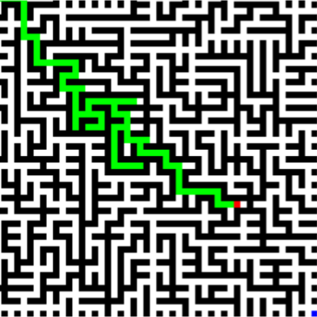

# maze-game
Giving a player a randomly generated maze to solve made with SDL2.


### Algorithms
- Randomized Prim's Algorithm for maze generation
### Dependencies
```
SDL2
```
### Build and Run
```
$ g++ source.cpp -w -lSDL2main -lSDL2 -o source
$ ./source
```